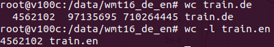

# W251 HW09 Richard Ryu

## What 

We are training a Transformer-based Machine Translation Network on a small English to German WMT corpus

## How

1. Provision 2 v100 virtual machiness through IBM Cloud Softlayer (AC2-16X120X100 with 2 TB SAN drive each)

2. On each VMs, create openseq2seq docker image and run the docker in shell mode.

```docker run --runtime=nvidia -d --name openseq2seq --net=host -e SSH_PORT=4444 -v /data:/data -p 6006:6006 openseq2seq```

```docker exec -ti openseq2seq bash```
3. Setup mpi on both VMs
```mpirun -n 2 -H <vm1 private ip address>,<vm2 private ip address> --allow-run-as-root hostname```

4. pull data to be used in neural machine translation training
```cd /opt/OpenSeq2Seq \ scripts/get_en_de.sh /data/wmt16_de_en```

5. Make configuration changes to ```/data/transformer-base.py```

6. Run Training
```nohup mpirun --allow-run-as-root -n 4 -H <vm1 private ip address>:2,<vm2 private ip address>:2 -bind-to none -map-by slot --mca btl_tcp_if_include eth0 -x NCCL_SOCKET_IFNAME=eth0 -x NCCL_DEBUG=INFO -x LD_LIBRARY_PATH python run.py --config_file=/data/transformer-base.py --use_horovod=True --mode=train_eval &```

## Results


## Questions

1. How long does it take to complete the training run? (hint: this session is on distributed training, so it will take a while)
* It took about 19 hours on 2 v100 vms with 3 GPUs to complete 50,000 steps. On average, 100 steps were takin about 104 seconds, therefore we can assume that each step took about a second to complete. 

2. Do you think your model is fully trained? How can you tell?
* According to the Eval_BLEU_Score the line has not plateaud yet and seems to be still moving. Therefore, I think the training is not complete at 50,000 steps and there's more learning to happen. 

3. Were you overfitting?
* Based on the 50,000 steps of training, the chart on eval_loss doesn't seem to indicate overfitting. However, if we continue to train more steps beyond 50,000 steps, I believe that the eval_loss will begin to plateau around 1.7 and indicate overfitting.

4. Were your GPUs fully utilized?
* All 3 GPUs were close to full utilization during the distributed training (mpirun job)
* v100c


* v100d


5. Did you monitor network traffic (hint: apt install nmon ) ? Was network the bottleneck?
* There were no clear indication of network bottleneck during the training. Network statistics were monitored through ```nmon```


6. Take a look at the plot of the learning rate and then check the config file. Can you explan this setting?
* The config file had the initial learning rate of 2.0 with "warmup_steps" of 8,000. If you observe the learning_rate graph, we can see the learning rate climb until the 8,000th step and start to decline afterwards. 


7. How big was your training set (mb)? How many training lines did it contain?
* The training set was 711mb for the 'de' version and 637mb for the 'en version. Both files had 4,562,102 lines.




8. What are the files that a TF checkpoint is comprised of?
* TF checkpoint contains best_models, checkpoints, tf_events output and model paths.

9. How big is your resulting model checkpoint (mb)?
* The checkpoint was ~ 950mb big


10. Remember the definition of a "step". How long did an average step take?
* According to the training log, each step took about 1.4 seconds. Considering that we were working with 3 GPUs, we can assume that each step took about 0.46 seconds per GPU.


11. How does that correlate with the observed network utilization between nodes?
* Increased network utilization generally lead to "faster" training time for each step. 

