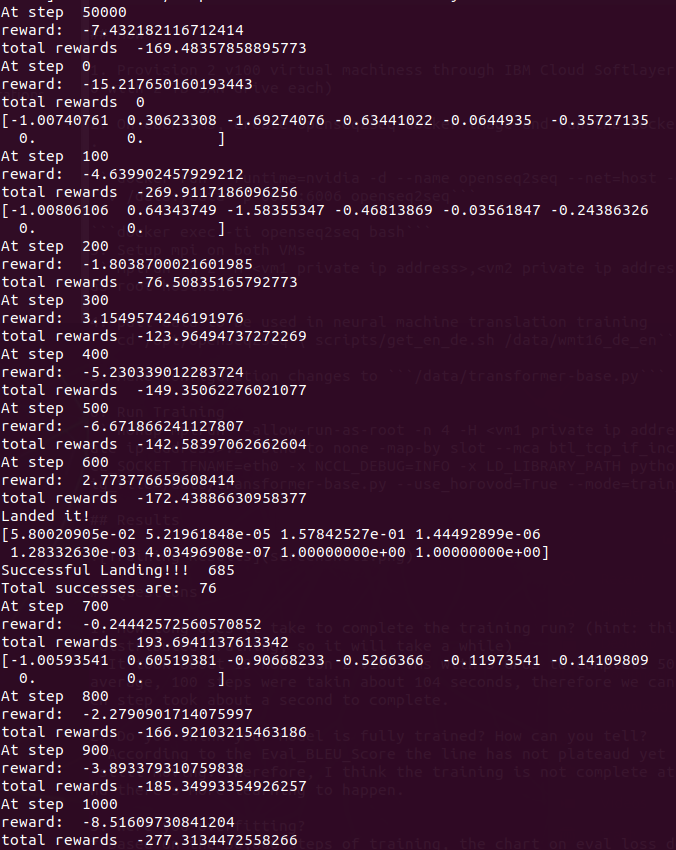
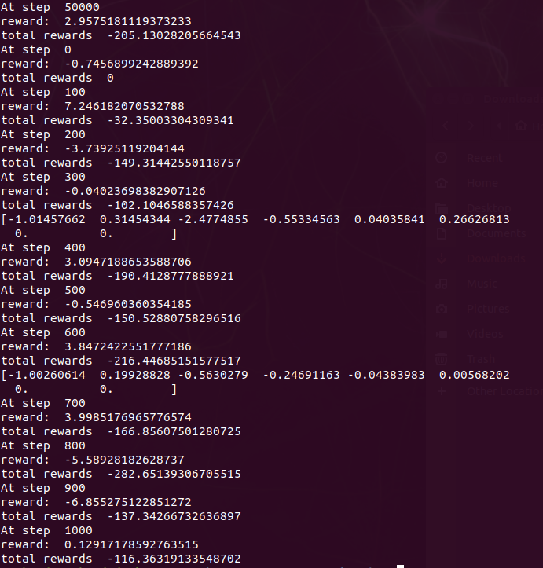
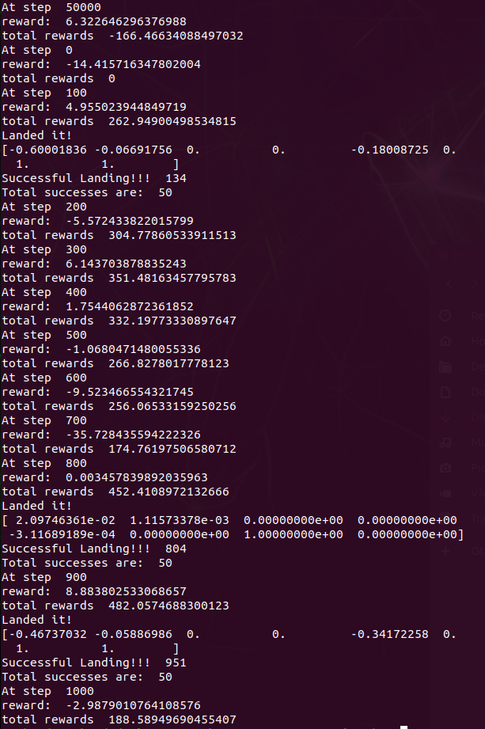
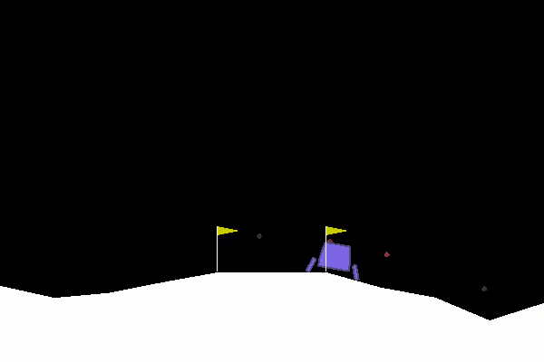

# W251 HW11 Richard Ryu

## What

We are training a Lunar Lander on OpenAI Gym's platform powered by our Jetson TX-2. Goal is to land the Lunar Lander on the moon safely as much as possible

## How

Use Reinforcement Learning and tweak the model parameters to improve the baseline model results.

#### Baseline Model

Below is the configuration for our baseline model

```def nnmodel(input_dim):
    model = Sequential()
    model.add(Dense(32, input_dim=input_dim, activation='relu'))
    model.add(Dense(16, activation='sigmoid'))
    model.add(Dense(1))
    model.compile(loss='mean_squared_error', optimizer='adam', metrics=['accuracy'])
    return model

...
    model = nnmodel(10)

...
    training_thr = 3000
    total_itrs = 50000
...
        if steps > training_thr and steps %1000 ==0:
            # re-train a model
            print("training model model")
            modelTrained = True
            model.fit(np.array(X_train),np.array(y_train).reshape(len(y_train),1), epochs = 10, batch_size=20)
...
```

We can observe that our baseline model had 10 input parameters with 32 neurons as the first hidden layer and a second hidden layer with 16 neurons, which all ends up with a single ouput parameter. The model is using Mean Squared Error for its loss function and Adam optimizer. The training stops at 50,000 steps and the model was able to land the pod 76 times. 

##### Baseline Results

Our Baseline model ended with -169.48 total rewards at the end of 50,000 steps, and was able to successfully land the pod 76 times. During the evaluation, the baseline model was able to land the pod once and ended with the total reward of -277.313.




[video download link](https://cos-week11.s3.us-east.cloud-object-storage.appdomain.cloud/frame50000.mp4)


#### Second Model

In an attempt to improve our baseline results, I went ahead and added an extra hidden layer with 64 neurons as the first hidden layer and relied on ReLu activation function for all three hidden layers. Below is the configuration:

```def nnmodel(input_dim):
    model = Sequential()
    model.add(Dense(64, input_dim=input_dim, activation='relu'))
    model.add(Dense(32, activation='relu'))
    model.add(Dense(16, activation='relu'))
    model.add(Dense(1))
    model.compile(loss='mean_squared_error', optimizer='adam', metrics=['accuracy'])
    return model

...
    model = nnmodel(10)

...
    training_thr = 3000
    total_itrs = 50000
...
        if steps > training_thr and steps %1000 ==0:
            # re-train a model
            print("training model model")
            modelTrained = True
            model.fit(np.array(X_train),np.array(y_train).reshape(len(y_train),1), epochs = 10, batch_size=20)
...
```

##### Second Model Results

The second model ended with -205.13 total rewards at the end of 50,000 steps, and was able to successfully land the pod 60 times. During the evaluation, the second model was not able to land the pod, but ended with the total reward of -116.363, which was a higher score than our baseline model. 

NOTE: I'm assuming that there were some 'close' landings that didn't qualify as a "successful" landing, but yielded high reward points. This is evident in the video below. We can notice that the pod is a lot more stable around 50,000 steps when compared to the training video of the baseline model at around 50,000 steps above. 




[video_download_link](https://cos-week11.s3.us-east.cloud-object-storage.appdomain.cloud/m2_frame50000.mp4)


#### Third Model

On my third attempt, I kept the layer structure from the second model (since it was better than the baseline model), and increased the number of epochs from 10 to 20 and batch_size from 20 to 50. Also, instead of using 'adam' optimizer, I went ahead and used 'adamax' optimizer for the sake of experiment. Below is the configuration:

```def nnmodel(input_dim):
    model = Sequential()
    model.add(Dense(64, input_dim=input_dim, activation='relu'))
    model.add(Dense(32, activation='relu'))
    model.add(Dense(16, activation='relu'))
    model.add(Dense(1))
    model.compile(loss='mean_squared_error', optimizer='adamax', metrics=['accuracy'])
    return model

...
    model = nnmodel(10)

...
    training_thr = 3000
    total_itrs = 50000
...
        if steps > training_thr and steps %1000 ==0:
            # re-train a model
            print("training model model")
            modelTrained = True
            model.fit(np.array(X_train),np.array(y_train).reshape(len(y_train),1), epochs = 20, batch_size=50)
...
```

##### Third Model Results

The third model ended with -166.47 total rewards at the end of 50,000 steps, and was able to successfully land the pod 50 times. During the evaluation, the third model was able to land the pod 3 times, and ended with the total reward of 188.59.





[video_download_link](https://cos-week11.s3.us-east.cloud-object-storage.appdomain.cloud/m3_frame50000.mp4)


## Food for Thought

Just in 2 iterations, we were able to go from -277.313 total rewards to 188.59 total rewards. Optimization of the model parameters will lead to better results but I'm still figuring out how to "optimizer faster".

