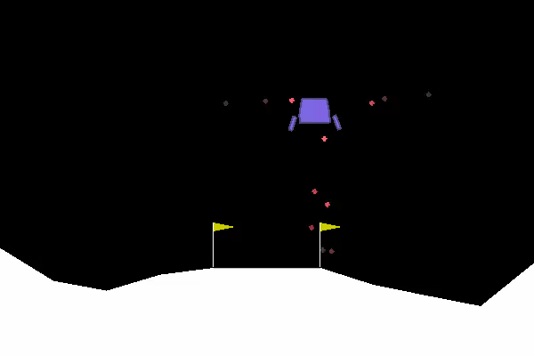

# W251 HW11 Richard Ryu

## What

We are training a Lunar Lander on OpenAI Gym's platform powered by our Jetson TX-2. Goal is to land the Lunar Lander on the moon safely as much as possible

## How

Use Reinforcement Learning and tweak the parameters of our models to improve upon the baseline model.

#### Baseline Model

Below is the configuration for our baseline model

```def nnmodel(input_dim):
    model = Sequential()
    model.add(Dense(32, input_dim=input_dim, activation='relu'))
    model.add(Dense(16, activation='sigmoid'))
    model.add(Dense(1))
    model.compile(loss='mean_squared_error', optimizer='adam', metrics=['accuracy'])
    return model

...
    model = nnmodel(10)

...
    training_thr = 3000
    total_itrs = 50000
...
        if steps > training_thr and steps %1000 ==0:
            # re-train a model
            print("training model model")
            modelTrained = True
            model.fit(np.array(X_train),np.array(y_train).reshape(len(y_train),1), epochs = 10, batch_size=20)
...
```



[video download link](https://cos-week11.s3.us-east.cloud-object-storage.appdomain.cloud/frame50000.mp4)


